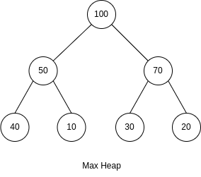
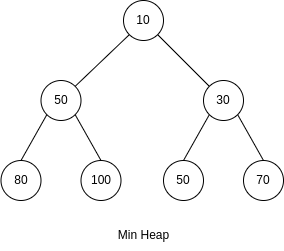

# Heap

A Heap is a complete binary tree data structure that satisfies the heap property.

1. **Max-Heap**: In a max-heap, the value of each parent node is greater than or equal to the values of its children. Thus, the maximum element in a max-heap is always at the root.

2. **Min-Heap**: In a min-heap, the value of each parent node is less than or equal to the values of its children. This means the minimum element is at the root.

## Operations

- `insert`: Adding a new element to the heap while maintaining the heap property. The element is initially added to the end of the array (the bottom-most, right-most empty spot in the tree structure), and then the heap property is restored by "bubbling up" this element to its correct position.
- `extractMax` or `extractMin`: Removing and returning the maximum element (in a max-heap) or the minimum element (in a min-heap) from the heap. After the root is removed, the last element in the heap is typically moved to the root, and the heap property is restored by "sifting down" this element to its corrent position.
- `peek`: Returning the element at the root of the heap without removing it, i.e., the maximum element in a max-heap or the minimum element in a min-heap.
- Heapify: Converting a random array of elements into a heap. This process involves rearranging the elements to satisfy the heap property and is typically performed in $O(n)$ time.
- `increaseKey` or `decreaseKey`: Modifying the value of a node and then restoring the heap property accordingly. This is particularly useful in algorithms like Dijkstra's, where the priority (or "distance") of a node might decrease as the algorithm progresses.

## Usage

Heaps are particularly useful for priority queue implementations because they allow for quick access to the highest or lowest priority element. They also play a critical role in efficient algorithms such as Heapsort, and in graph algorithms like Dijkstra's shortest path algorithm.