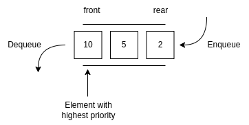

# Priority Queue

In computer science, a priority queue is an abstract data-type similar to a regular queue or stack data structure. Each element in a priority queue has an associated priority. In a priority queue, elements with high priority are served before elements with low priority.

In a priority queue, each element has a priority value associated with it. When you add an element to the queue, it is inserted in a position based on its priority value. For example, if you add an element with a high priority value to a priority queue, it may be inserted near the front of the queue, while an element with a low priority value may be inserted near the rear.

## Operations

- **Enqueue (Insert)**: Adding a new element to the priority queue.
- **Dequeue (Delete)**: Removing the highest priority element from the priority queue.
- **Peek** / **Top**: Viewing the highest priority element without removing it.
- **Update** / **Promotion**: Modifying the priority of an element already in the queue, usually when its priority changes.

## Types in Terms of Order

- **Ascending Priority Queue**: In an ascending priority queue, elements are dequeued in ascending order of priority, meaning that the element with the lowest priority is dequeued first. For example, if you have elements with priorities 1, 3, 2, and 4, in an ascending priority queue, the element with priority 1 would be dequeued first, followed by 2, then 3, and finally 4.
- **Descending Priority Queue**: In a descending priority queue, elements are dequeued in descending order of priority, meaning that the element with the highest priority is dequeued first. Using the same set of elements with priorities 1, 3, 2, and 4, in a descending priority queue, the element with priority 4 would be dequeued first, followed by 3, then 2, and finally 1.

## Normal Queue vs. Priority Queue

There is no priority attached to elements in a queue, the rule of first-in-first-out (FIFO) is implemented whereas, in a priority queue, the elements have a priority. The elements with higher priority are served first.

## Implementation

- Priority Queue with Array
- Priority Queue with Linked List
- Priority Queue with Heap
- Priority Queue with Binary Search Tree