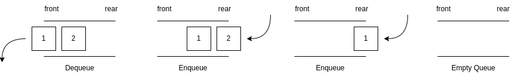

# Queue

A queue is a linear data structure that follows the First-In-First-Out (FIFO) principle. Elements are added to the rear and removed from the front of the queue.

## Basic Operations

- `enqueue()`: Adds an element to the rear of the queue.
- `dequeue()`: Removes and returns the element from the front of the queue.
- `peek()` or `front()`: Returns the value of the front element without removing it.
- `rear()`: Returns the value of the rear element without removing it.
- `isEmpty()`: Checks if the queue is empty.
- `isFull()`: Checks if the queue is full.
- `size()`: Returns the total number of elements of the queue.

## Time Complexity

- `enqueue()`: When adding an element to the end of the array using the `push()` method in JavaScript, the time complexity is typically $O(1)$ on average. This is because JavaScript arrays are dynamic and can resize themselves when needed. If there is enough space in the underlying array, the new element can be added in constant time. However, if the array needs to be resized, the time complexity can be $O(n)$, where $n$ is the number of elements in the array. This is because all exsiting elements may need to be compiled to a new, larger array.
- `dequeue()`: When removing an element from the front of the array using the `shift()` method in JavaScript, the time complexity is $O(n)$. This is because removing an element from the beginning of an array requires shifting all remaining elements to the left by one position to fill the gap left by the removed element. As a result, the time taken is proportional to the number of elements in the array, making it $O(n)$ in the worst case.

## References

- https://www.geeksforgeeks.org/queue-data-structure/